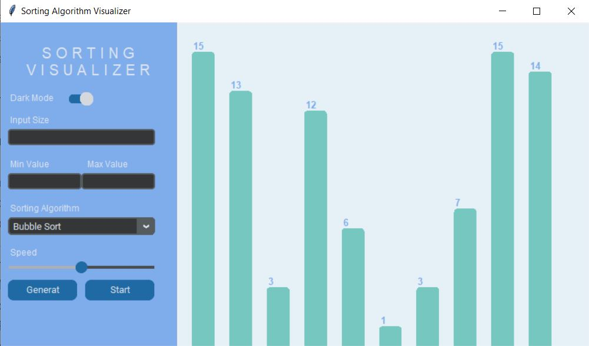

# Sorting Algorithm Visualizer 🌀✨

Welcome to the **Sorting Algorithm Visualizer**! This interactive tool lets you explore and visualize different sorting algorithms in a dynamic and engaging way. Whether you're a student, teacher, or just a curious mind, this visualizer provides an intuitive way to understand how various sorting algorithms work under the hood.

 <!-- Replace with actual image path -->

## Features 🌟

- **Interactive Visualizations**: Watch as Bubble Sort, Quick Sort, and Merge Sort operate in real-time.
- **Customizable Parameters**: Adjust the input size, value range, and sorting speed to see how the algorithms perform under different conditions.
- **Dark Mode**: Toggle between light and dark themes to suit your preference.
- **User-Friendly Interface**: Simple controls and a clean layout make it easy to use.

## Getting Started 🚀

### Prerequisites

Make sure you have Python 3.x installed on your machine.

### Installation

1. **Clone the repository**:
   ```bash
   git clone https://github.com/avishkaJSPshehan/Sorting-Algorithm-Visualizer.git
   ```
2. **Navigate to the project directory**:
   ```bash
   cd sorting-algorithm-visualizer
   ```
3. **Install the required packages**:
   ```bash
   pip install customtkinter
   ```

### Running the Application

1. **Start the visualizer**:
   ```bash
   python main.py
   ```
2. **Use the interface** to:
   - Set the input size and value range
   - Choose the sorting algorithm
   - Adjust the sorting speed
   - Toggle dark mode
   - Generate and start the sorting visualization

## User Interface Overview 🎨

- **Main Heading**: Displays the title of the application.
- **Dark Mode Switch**: Toggle between dark and light themes.
- **Input Fields**: Set the size of the array and the range of values.
- **Algorithm Selection**: Choose between Bubble Sort, Quick Sort, and Merge Sort.
- **Speed Slider**: Adjust the speed of the sorting visualization.
- **Generate Button**: Create a new random array based on your settings.
- **Start Button**: Begin the sorting process with the selected algorithm.

## Project Structure 📂

```
sorting-algorithm-visualizer/
│
├── main.py                # Main application file
├── bubbleSort.py          # Bubble sort algorithm
├── quickSort.py           # Quick sort algorithm
├── mergeSort.py           # Merge sort algorithm
└── README.md              # Project readme file
```

## How It Works 🔍

### Main Application (`main.py`)

- **UI Initialization**: Sets up the main Tkinter window using CustomTkinter for enhanced visuals.
- **Interactive Controls**: Includes input fields for array size, value range, sorting speed, and algorithm selection.
- **Dark Mode**: Switch between light and dark themes with a toggle switch.
- **Data Visualization**: The `drawData` function visualizes the sorting process step-by-step on the canvas.

### Sorting Algorithms

- **Bubble Sort (`bubbleSort.py`)**: A simple, comparison-based sorting algorithm.
- **Quick Sort (`quickSort.py`)**: An efficient, divide-and-conquer sorting algorithm.
- **Merge Sort (`mergeSort.py`)**: A stable, divide-and-conquer sorting algorithm that guarantees O(n log n) performance.

## Contributing 🤝

Contributions are welcome! If you have any suggestions or improvements, feel free to fork the repository, submit issues, or create pull requests.

## Acknowledgments 🙌

A big thanks to the developers of Tkinter and CustomTkinter for their fantastic libraries that make projects like this possible.

---
